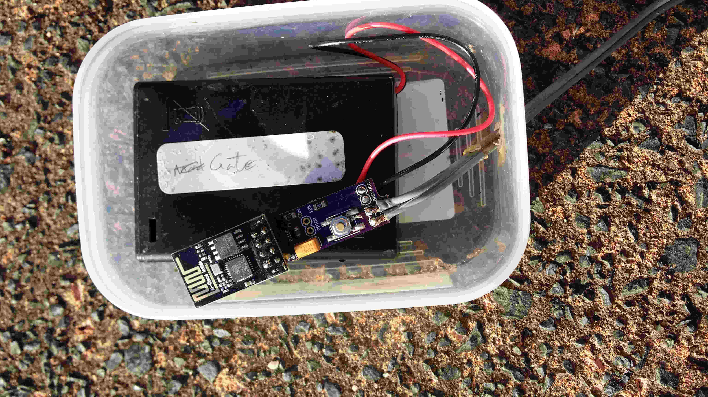
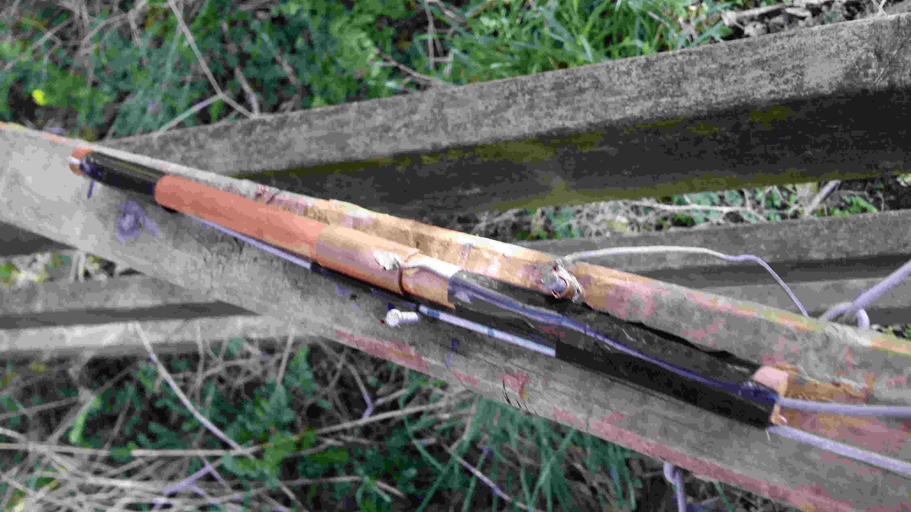
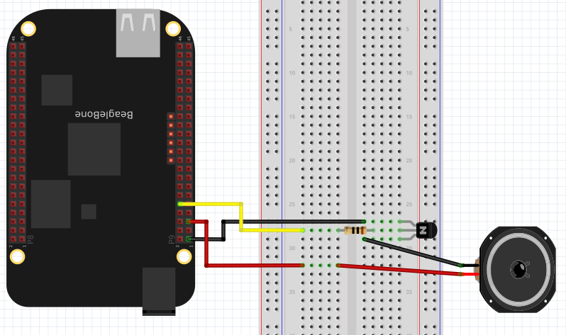
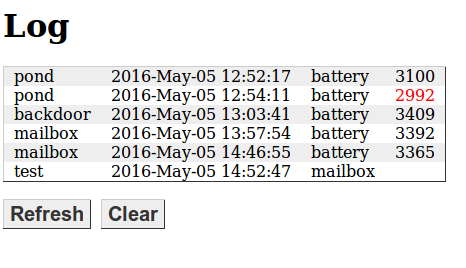

ESP8266-automation
==

Code and circuitry to support simple event driven signaling from remote sensors (ESP8266) to a server (BeagleBone) over WIFI. The remote sensors detect an n/o switch being closed and they send a message to the server which decides what to do with it. Normally it logs it and there is a web page to query the log. But for some messages it will sound a chime. The remote sensors also send a battery status when they power up.

I could have used some public service to manage the logging, and eliminated the Beaglebone, but I tend to resist exposing home automation events to public services and I had the Beaglebone already acting as a file server. I'm not sure I would have easily managed the chime from a public service, though probably another ESP listening on the network could do it.

Remote Switch
=

The remote sensors use an ESP8266-01. Use 3xAA batteries as the power supply and any convenient ssensor. A simple mercury switch is fine but I did something more complicated in the one shown in the following image.

The black box is an AA battery holder containing 3 NiMH rechargeable AA batteries. The wires from that are connected to the purple board, the one I designed, and at the other end the ESP8266-01 is plugged in.

The purple board has a test button on it which forces it to send a message. It also has a pair of grey wires going to the n/o switch. A slightly simpler configuration is to solder a mercury switch directly to those connections and make the unit standalone. If you do that make sure you adjust the way the mercury switch is lying to ensure it is open until disturbed. I use that configuration on vermin traps.

This configuration, however, is for my gate. I have a wooden gate on my drive and I rigged a slider on it using some fencing wire, bits of copper and a piece of dowel.

On the right hand side you can see two grey wires. The lower one is fencing wire, quite stiff. That is attached to the gate and provides the movement. The other wire is electrical and is the other end of one of the wires you saw earlier. Its mate is attached to the piece of copper wrapped around the nail. Driven by the fencing wire the dowel slides back and forth and the copper sleeve on the dowel touches the copper on the nail, making the conection. That triggers the ESP to send a signal with it's internal serial number (see the code) to the Beaglebone over WIFI.

I have a similar arrangement on my mailbox, but that is triggered by a mercury switch positioned so that my mail lady's vehicle (she comes in a car because we're rural) runs over a buried metal rod and that jiggles the mercury switch envough to trigger the unit there.
  
The project board is defined in the Eagle files under the ESP8266TX directory. There are connectors on the board for VCC and GND as well as two for the Switch (eg the mercury switch). This switch earths the CH_PD pin on the ESP which will wake it from deep sleep. You can solder the ESP onto it directly but I prefer to use [these connectors](https://www.aliexpress.com/item/50-pcs-4P-4pin-Female-Single-Row-Straight-Header-Strip-Socket-Connector-Pitch-2-54mm/32442780670.html) so I can unplug the ESP if I need to reflash it. Flash the ESP with the code in RemoteSwitch.ino [details here](https://madurasoftware.com/blog/esp8266-01-flashing-tool). There is a note in the top of the ino file explaining how to specify your own WIFI network.

You can order the board ($4 for 3) from [OSH PARK]

<a href="https://www.oshpark.com/shared_projects/U9vJnOx3"></img></a>

It is worth while removing the red LED from the ESP because it runs all the time and reduces battery life. Just grab it with some small pliers and pull.

BeagleBone
=

The server is a Beaglebone running Nginx with some PHP scripts.

To set up the BeagleBone just install [Nginx](https://www.nginx.com/resources/wiki/start/topics/tutorials/install/#) and copy the php scripts from this project into `/usr/share/nginx/www`

If you want to use the chime then you need to wire up the BeagleBone like this:

And arrange for the `BeagleBone/startup/gpio60.sh` script to run at startup.

But better than a breadboard is to use a PCB. You'll find the one I used under BeagleBone/BBConnector in this project. And you can:

<a href="https://www.oshpark.com/shared_projects/K8a6LmDk"></img></a>

All this is doing is taking the 5V supply from the Beaglebone and applying it to the chimer. The chimer I had was part of an old alarm system I had lying around. It took 5V to sound a 'ding-dong' like a door bell. I'm controlling it with the transistor using a 3.3V signal from the Beaglebone GPIO. The transistor I used is a through hole one I happened to have.

Also create a file `/home/receiver/log.csv` and use chmod to make it writeable from anyone. This is the log file and it can be viewed by browsing to `http://<your BeagleBone>/printlog.php`. You should see something like this:

This shows mostly battery levels logged at startup, but the second entry shows the value in red, indicating it has dropped below 3000. The last entry is an actual event on the mailbox and was used to test the chime. I've since added a reboot and test button because sometimes I want to reboot the Beaglebone without trekking all the way upstairs to do it, and the test button triggers the chime without my having to go outside and swing on the gate.

To get the log showing the right names for the devices you need to edit the printlog.php file. Specifically this line:

`$sources = array("test" => "123","pond" => "16058556","backdoor" => "8442031", "mailbox" => "8425573");`

The values it is mapping against are the unique id of each ESP8266 obtained from the `ESP.getChipId()` call. If there is no mapping value the unmapped value appears in the log.

The same thing appears in the processevent.php file where the message source name is used to decide hether to sound the chime or not. You can customise this as needed.

To log the time properly you must ensure the BeagleBone's clock is set correctly. there is help on how to do this [here](http://derekmolloy.ie/automatically-setting-the-beaglebone-black-time-using-ntp/) however I had to use usr/sbin/ntp rather than usr/bin/ntp on my system.