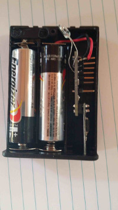
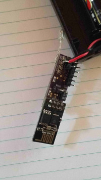

ESP8266-automation
==

Code and circuitry to support simple event driven signaling from remote sensors (ESP8266) to a server (BeagleBone). The remote sensors detect an n/c switch being closed and they send a message to the server which decides what to do with it. Normally it logs it and there is a web page to query the log. But for some messages it will sound a chime. The remote sensors also send a battery status when they power up.

Remote Switch
=

The remote sensors use an ESP8266-01. Use 2xAA batteries as the power supply and any convenient switch as the switch. A simple mercury switch is good. A 3xAA battery case be slightly modified to hold just two AA batteries plus the ESP8266. The thing that looks like an LED is the mercury switch.

This shows the boards more clearly. The ESP8266-01 is soldered onto the project board which is, in turn, connected to the batteries.

The project board is defined in the Eagle files under the ESP8266TX directory. This board supports flashing the ESP8266-01 so you can solder the two boards together and know you can still change the code running on the ESP. There are connectors on the board for VCC and GND as well as two for the Switch (eg the mercury switch). This switch earths the CH_PD pin on the ESP which will wake it from deep sleep.

There are also pins relating to flashing. The FTDI I use is the [Basic FTDI from Sparkfun](https://www.sparkfun.com/products/9873) but any FTDI should work as long as it uses DTR the same way, ie grounds it just before it starts. Also it *must* be a 3v FTDI or you will fry your ESP8266. To flash the ESP just plug in the FTDI, make sure it is the right way around and I have marked GND on one end to help, and put jumpers on the JPVCC and GPIO0 pins. I use [these jumpers](http://www.aliexpress.com/item/100pcs-2-54mm-Jumper-Cap-Mini-Jumper-Short-Circuit-Cap-Connection-2-54mm/32514701340.html?spm=2114.13010608.0.97.stW9wL).

You can order the board from [OSH Park](<a href="https://www.oshpark.com/shared_projects/lX2y24Ii"></img></a>) (3 for under $3).

It is worth while removing the red LED from the ESP because it runs all the time and reduces battery life. Just grab it with some small pliers and pull.

Flash the RemoteSwitch image to the ESP8266. To compile it you need to have the Arduino environment installed. Then you need to edit the file local_network.h to include your own settings and copy it to:

`~/.arduino15/packages/esp8266/hardware/esp8266/2.0.0/tools/sdk/include`

For details on flashing the ESP8266 from an Arduino environment see [this link](http://iot-playground.com/blog/2-uncategorised/38-esp8266-and-arduino-ide-blink-example).

BeagleBone
=

The server is a Beaglebone running Nginx with some PHP scripts.

To set up the BeagleBone just install [Nginx](https://www.nginx.com/resources/wiki/start/topics/tutorials/install/#) and copy the php scripts into `/usr/share/nginx/www`

If you want to use the chime then you need to wire up the BeagleBone like this:

And arrange for the `BeagleBone/startup/gpio60.sh` script to run at startup.

Also create a file `/home/receiver/log.csv` and use chmod to make it writeable from anyone. This is the log file and it can be viewed by browsing to `http://<your BeagleBone>/printlog.php`. You should see something like this:

This shows mostly battery levels logged at startup, but the second entry shows the value in red, indicating it has dropped below 3000. The last entry is an actual event on the mailbox and was used to test the chime.

To get the log showing the right names for the devices you need to edit the printlog.php file. Specifically this line:

`$sources = array("test" => "123","pond" => "16058556","backdoor" => "8442031", "mailbox" => "8425573");`

The values it is mapping against are the unique id of each ESP8266 obtained from the `ESP.getChipId()` call. If there is no mapping value the unmapped value appears in the log.

The same thing appears in the processevent.php file where the message source name is used to decide hether to sound the chime or not. You can customise this as needed.

To log the time properly you must ensure the BeagleBone's clock is set correctly. there is help on how to do this [here](http://derekmolloy.ie/automatically-setting-the-beaglebone-black-time-using-ntp/) however I had to use usr/sbin/ntp rather than usr/bin/ntp on my system.